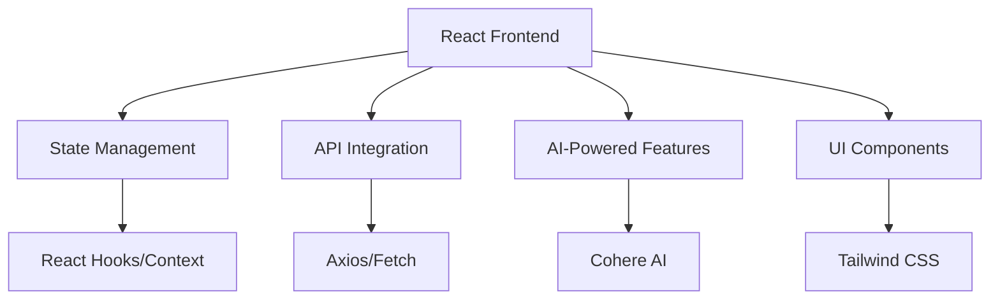

# CRM Frontend

## Overview
A Customer Relationship Management (CRM) frontend application designed to streamline campaign management and customer interactions.

## Local Setup Instructions

### Prerequisites
- Node.js (recommended version 16+ or latest LTS)
- npm (Node Package Manager)

### Installation Steps
1. Clone the repository
```bash
git clone https://github.com/KRATIAGARRWAL/crm-frontend.git
cd crm-frontend
```

2. Install dependencies
```bash
npm install
```

3. Run the development server
```bash
npm run dev
```

4. Open your browser and navigate to `http://localhost:3000`

## Architecture Diagram



## Technology Stack and AI Tools

### Frontend Technologies
- React.js
- React Hooks for State Management
- React Context API for global state
- Tailwind CSS for styling
- Axios for API Requests

### AI Integration
- **Cohere AI**: 
  - Used for generating intelligent suggestions based on campaign objectives
  - Provides natural language processing capabilities
  - Helps in creating personalized campaign recommendations

### Key Features
- Campaign management
- Intelligent suggestion generation
- Responsive UI design

## Known Limitations and Assumptions

### Technical Limitations
- Requires active internet connection for AI-powered suggestions
- Dependent on Cohere AI's API availability and response times
- Limited to modern browser support (Chrome, Firefox, Safari, Edge)

### Functional Assumptions
- User has valid API credentials for Cohere AI
- Network connectivity is stable
- User has basic understanding of CRM concepts
